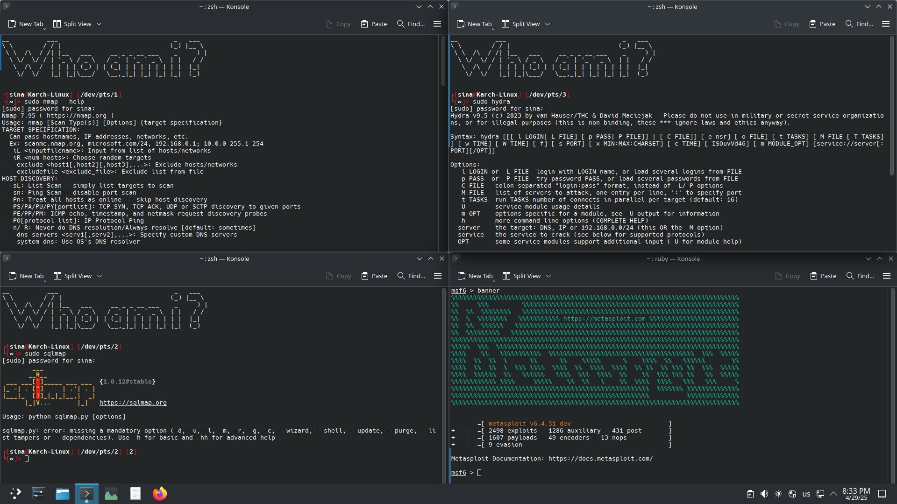

# [Karch-linux](https://github.com/Sina2468/Karch-Linux.git) .  

Karch-linux :

A **live** version of Arch-linux with some Kali-linux tools such as :

1. nmap
2. Sqlmap 
3. hydra
4. wifite
5. metasploit-framework

[and more](assets/Tools_list.txt)

## Installation

1. Download the zip file of Karch-linux

    https://github.com/Sina2468/Karch-Linux/archive/refs/heads/main.zip

2. Extract the zip 

3. use **.iso** file :

    1. Make a bootable USB from **.iso** file with [**Rufus**](https://rufus.ie/)

    2. Or use it in virtual machines like vmware or virtualbox or any else

4. Login with this info :

    * User = Sina

    * Password = arvin1010

5. Enjoy it

## License

[MIT licensed](LICENSE)
